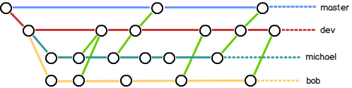

# Git 

#### 安装

Linux

```
#Is git installed?
git
#Debian & Ubuntu Linux
sudo apt-get install git
```

Windows

​	Git官网下载->Git Bash->初始化

```
$ git config --global user.name "Your Name"
$ git config --global user.email "email@example.com"
```

### 创建版本库

### 时光机穿梭

#### 版本回退

```
#显示从最近到最远的提交日志
git log
#tips:press'q' to quit in VSCode
#简洁显示log
git log --pretty=oneline
```

#### 工作区和暂存区

Working Directory:在电脑里能看到的目录

Repository:

  


#### 管理修改

 每次修改，如果不用`git add`到暂存区，那就不会加入到`commit`中。也就是最终的版本需要先add再commit.

##### 简化`git add`

> 1. **逐个添加文件**: 您可以使用`git add    ...`命令，将每个文件逐个添加到暂存区。例如，`git add file1.txt file2.txt file3.txt`。
> 2. **通配符添加文件**: 如果要添加同一目录下的多个文件，可以使用通配符来简化命令。例如，`git add *.txt`将添加该目录下所有扩展名为.txt的文件。
> 3. **递归添加文件**: 如果要添加整个目录及其子目录下的所有文件，可以使用递归选项`-A`或`--all`。例如，`git add -A`或`git add --all`将添加所有文件和目录的更改。

#### 撤销修改

场景1：当你改乱了工作区某个文件的内容，想直接丢弃工作区的修改时，用命令`git checkout -- file`。

场景2：当你不但改乱了工作区某个文件的内容，还添加到了暂存区时，想丢弃修改，分两步，第一步用命令`git reset HEAD `，就回到了场景1，第二步按场景1操作。

场景3：已经提交了不合适的修改到版本库时，想要撤销本次提交，参考[版本回退](https://www.liaoxuefeng.com/wiki/896043488029600/897013573512192)一节，不过前提是没有推送到远程库。

#### 删除文件

`rm <file>`删除文件后此时工作区和版本库中不一致,若确实要从版本库中删除则使用 `git rm ``git commit ` ,若删错了,`git checkout -- test.txt`,即用版本库中的版本替换工作区中的版本.

### 远程仓库
step1.generate SSH Key

​	在用户主目录下，看看有没有.ssh目录，如果有，再看看这个目录下有没有`id_rsa`和`id_rsa.pub`这两个文件，如果已经有了，可直接跳到下一步。如果没有，打开Shell（Windows下打开Git Bash），创建SSH Key：

```
 $ ssh-keygen -t rsa -C "youremail@example.com"
```

 	如果一切顺利的话，可以在用户主目录里找到`.ssh`目录，里面有`id_rsa`和`id_rsa.pub`两个文件，这两个就是SSH Key的秘钥对，`id_rsa`是私钥，不能泄露出去，`id_rsa.pub`是公钥，可以放心地告诉任何人。

step2. 登陆GitHub，打开“Account settings”，“SSH Keys”页面;

然后，点“Add SSH Key”，填上任意Title，在Key文本框里粘贴`id_rsa.pub`文件的内容;

点“Add Key”，你就应该看到已经添加的Key.

#### 添加远程库

​	1.在Github创建"Create a new repo"

​	2.要关联一个远程库，使用命令`git remote add origin git@server-name:path/repo-name.git`；

​	3.关联一个远程库时必须给远程库指定一个名字，`origin`是默认习惯命名；

​	4.关联后，使用命令`git push -u origin master`第一次推送master分支的所有内容；

​	5.此后，每次本地提交后，只要有必要，就可以使用命令`git push origin master`推送最新修改；

​	6.SSH warning:

>  Git使用SSH连接，而SSH连接在第一次验证GitHub服务器的Key时，需要你确认GitHub的Key的指纹信息是否真的来自GitHub的服务器，输入`yes`回车即可。 

​	删除远程库

```
git remote -v
#查看远程库信息
git remote rm <name>
#根据名字删除(解除本地与远程的绑定关系)
```

#### clone

如果从0开始开发,最好的方式是先创建远程库,然后从远程库clone.

```
git clone git@github.com:<username>/<repo-name>.git
```

支持https/ssh协议,通常ssh协议更快.

### 分支管理

#### 创建与合并分支

```
#创建并切换到dev分支
git checkout -b dev
#相当于同时执行git branch dev git checkout dev
#查看当前分支
git branch
```
git merge <feature> 将feature分支合并到当前分支
#### 解决冲突
git log --graph 查看分支合并图
删除分支
git branch -d feature1

#### 管理策略

master分支应该非常稳定,仅用来发布,日常在dev分支
merge时,加上--no-ff合并后的历史有分支，能看出来曾经做过合并，而fast forward合并就看不出来曾经做过合并
#### 解决BUG分支
暂时用不到
#### feature分支
添加一个新功能时，你肯定不希望因为一些实验性质的代码，把主分支搞乱了，所以，每添加一个新功能，最好新建一个feature分支，在上面开发，完成后，合并(与dev分支)，最后，删除该feature分支。
开发一个新feature，最好新建一个分支；
如果要丢弃一个没有被合并过的分支，可以通过git branch -D <name>强行删除
#### 多人协作
远程库默认名称 origin
使用 git remote 查看远程库信息
git remote -v 查看详细信息 fetch表示可以抓取,push可推送
推送不同分支
	 git push origin master
	 git push origin dev

从本地推送分支，使用git push origin branch-name，如果推送失败，先用git pull抓取远程的新提交；

在本地创建和远程分支对应的分支，使用git checkout -b branch-name origin/branch-name，本地和远程分支的名称最好一致；

建立本地分支和远程分支的关联，使用git branch --set-upstream branch-name origin/branch-name；

从远程抓取分支，使用git pull，如果有冲突，要先处理冲突。
### 标签管理

